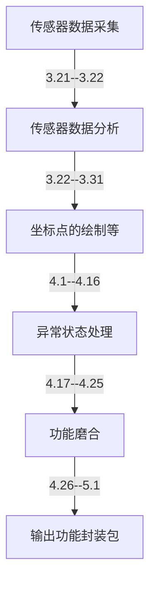

### 主要研究两个方向：

* **车辆路线轨迹收集和绘制**

车从围栏外回家，通过连续定位采集坐标，得到连续坐标点后绘制路线，绘制

的路线会和数据库中路线进行匹对，从而判断是否真正回家

* **汽车行驶状态的识别**

通过手机传感器判定主人运动状态，包括停留，行驶，步行等

### 基本功能和后期目标：

**基本功能**：

* 根据采集到的坐标，能够得到轨迹进行分析，判断出是否要回家。

* 能够识别出运动状态

**后期目标**

* 能够自主提供回家路线提供方案

  说明：系统自动列出围栏坐标点周围路线方案，用户可以自己选定

* 精准的识别出运动状态

  说明：开车状态很可能和骑车、坐公交等运动状态相近，需要更精准的判定。

### 待解决问题和想法：

* **手机传感器数据获取和保存**

  想法：使用一个数组保存在本地，会设定监听时间、数据个数。

* **得到传感器数据如何分析**

  目前还没有找到一种好的方式分析出合适模型

  想法：判定行驶状态会根据数据变化做出一定的适应性变化

  比如当检测是在行驶时，会把监听间隔拉长，在一段长的时间不做判断，

  而停留时，监听间隔时间会设置短点；还有很多细节需要探究。

* **连续点坐标的绘制，其中包含轨迹纠偏、降噪、异常点处理**

  处理方案一：根据已知的点作拟合方程，然后进行方程计算

  处理方案二：直接判断点是否在自己设定轨迹内，当若干个点满足就发送指令

* **弱网或弱gps信号状态的处理**

  想法：参照百度地图提供的方案，再自行做一些处理，补偿措施

* **和其他界面进如何交互**

  想法：在后期会慢慢的和其他人做的功能磨合，讨论

### 流程和进度时间表：

结果：

输出一个demo，会提供一个详细传感器数据处理后的分析结果，和一个轨迹绘制如何匹对的方案。