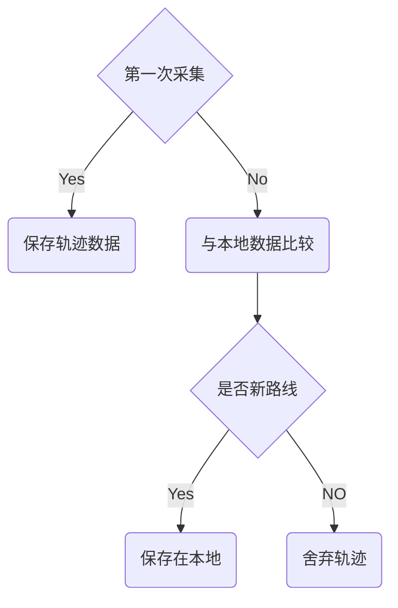

### 轨迹分析方案

会以车库门为中心点，构建两个围栏，分别为内栏和外栏，围栏都有进出报警检测，内栏与外栏之间为轨迹采集区。轨迹采集区应足够宽。

初期设定：内栏半径 50m；外栏半径为500 m；

预估车在进内栏时速度放缓 20km/h，约5m/s。在进入内栏后，短时间内计算出结果，结果然后开门。

#### **开始和结束:**

在触发外栏后，就会启动轨迹采集。

触发内栏，会停止采集，然后进行分析，分析结果作为开门依据。

触发外栏，也会停止采集，不会进行分析，直到再次触发外栏再采集点。

#### **采集方式：**

轨迹每次采集100个点进行分析，当超过100个取最新的进行分析。

#### **主要实现的过程**

**每次一条新路线回家都会由用户确定，确定之后才保存**

**当走一条新路线时，不会自动开门，但会提示用户是否手动开门**

****

#### **具体实现**

* 数据初始处理

  * **百度方式**

    * 动态实时轨迹(实时打包坐标点，发送处理，需购买鹰眼轨迹服务)
      * 优点：能够设置采集频率，和数据包坐标数量，可以和路线规划功能联合使用
      * 缺点：和网络信号优劣有关，不够精准
    * 静态轨迹(先采集点，然后绘制轨迹，鹰眼轨迹服务)
      * 优点：有优化算法，可以降噪、纠偏等，并且可以拿到优化好的数据
      * 缺点: 处理速度有待实验

  * **谷歌方式**

    * Roads API能够实现绑路，采集到的点，经过处理，会得到一系列在路上的点

      优点：网页实测，能够精准的给出绑路路线，开发文档详细。

      缺点：需要另外申请谷歌地图开发者KEY

* 数据本地处理

  目前通用比较算法如下：

  * CPD算法(Closest-Pair Distance)

    计算出两个序列最小值

    缺点：当相交时，不准确

  * SPD算法(Sum-of-Pairs Distance)

    计算两个序列中点与点之间的距离，然后根据距离作相似度计算 

    缺点：必须相同数量的点

  * DTW算法(Dynamic Time Warping)

    计算两序列点与点距离，数量可以不一样，处理后能够得出相似度。

    缺点：若存在噪点，影响会很大，所以需要去噪处理

  * LCS算法(Longest Common Subsequence)

    能够求出最长的公共子序列，给出两条序列，能够求出相似点的个数

  * EDR算法(Edit Distance on Real sequence)

    计算把一条序列变换成另一条序列所需要的插入、删除、替换操作的次数。

实施想法一：

采集一定数量点后，打包发给百度或者谷歌，得到降噪、纠偏、绑路的数据序列，先经过它们对数据进行一个初始处理，然后本地在用DTW算法进行相似度计算

实施想法二：

不通过任何服务和API，自行在使用LCS或者EDR算法基础上，做出一些优化，计算判断出相似度

注：整个服务实现基于app在手机后台运行。