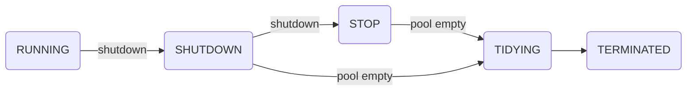

**问题引入**：如何并发执行一个程序？

在学校学习时或者工作中，我们经常碰到一个词，并发式编程，与并发一起的还有并行。

那什么是并发和并行呢？

解释：

并发：应用交替执行不同任务

并行：应用同时执行不同任务

例子：

并发：有这么一个小时，一个人要吃饭，然后看电视，听音乐

并行：还是一个小时，一个人边吃饭，边看电视，边听音乐


线程：共享进程的地址空间，是CPU调度和分派的基本单位

与进程区别：进程必须有自己的独立的地址空间，代码段、数据段、堆栈段、BSS

线程共享同一进程的地址空间，线程通信方便。

问题：为什么要用线程池？

每次创建和销毁线程需要浪费大量时间。

线程池的好处：

1、降低资源消耗<重复利用机制>

2、提高响应效率<不必要多次创建就可以执行>

3、方便管理<统一分配和调度>

线程池的种类：可缓存、定长、定时、单例

**newCachedThreadPool**

**newFixedThreadPool**

**newScheduleThreadPool**

**newSingleThreadExecutor**

最原始的线程池方法：

``` 
public ThreadPoolExecutor(int corePoolSize,
                              int maximumPoolSize,
                              long keepAliveTime,
                              TimeUnit unit,
                              BlockingQueue<Runnable> workQueue,
                              RejectedExecutionHandler handler)
```


队列：先进先出，后进后出

种类：非阻塞和阻塞队列 BlockingQueue，ConcurrentLinkedDeque

区别：

阻塞队列：存放超出队列总数，进行等待

非阻塞队列：存放超出队列总数，则丢弃队列信息


```
ArrayBlockingQueue、LinkedBlockingQueue、SynchronousQuene、PriorityBlockingQueue
```

(1) ArrayBlockingQueue：基于数组结构的有界阻塞队列，按FIFO排序任务； 
(2) LinkedBlockingQuene：基于链表结构的阻塞队列，按FIFO排序任务，吞吐量通常要高于ArrayBlockingQuene； 
(3) SynchronousQuene：一个不存储元素的阻塞队列，每个插入操作必须等到另一个线程调用移除操作，否则插入操作一直处于阻塞状态，吞吐量通常要高于LinkedBlockingQuene； 
(4) priorityBlockingQuene：具有优先级的无界阻塞队列；

| -       | Throws Exception | Special Value | Blocks | Times Out                   |
| ------- | ---------------- | ------------- | ------ | --------------------------- |
| Insert  | add(o)           | offer(o)      | put(o) | offer(o, timeout, timeunit) |
| Remove  | remove(o)        | poll()        | take() | poll(timeout, timeunit)     |
| Examine | element()        | peek()        |        |                             |

1. ThrowsException：如果操作不能马上进行，则抛出异常
2. SpecialValue：如果操作不能马上进行，将会返回一个特殊的值，一般是true或者false
3. Blocks:如果操作不能马上进行，操作会被阻塞
4. TimesOut:如果操作不能马上进行，操作会被阻塞指定的时间，如果指定时间没执行，则返回一个特殊值，一般是true或者false

```
public interface BlockingQueue<E> extends Queue<E> {
    /**
     * 插入元素e至队尾, 如果队列已满, 则阻塞调用线程直到队列有空闲空间.
     */
    void put(E e) throws InterruptedException;
    /**
     * 插入元素e至队列, 如果队列已满, 则限时阻塞调用线程，直到队列有空闲空间或超时.
     */
    boolean offer(E e, long timeout, TimeUnit unit)
        throws InterruptedException;
    /**
     * 从队首删除元素，如果队列为空, 则阻塞调用线程直到队列中有元素.
     */
    E take() throws InterruptedException;
    /**
     * 从队首删除元素，如果队列为空, 则限时阻塞调用线程，直到队列中有元素或超时.
     */
    E poll(long timeout, TimeUnit unit) throws InterruptedException;
```


在说blockingqueue先了解下下ReentrantLock 和 Condition:
重入锁ReentrantLock:
ReentrantLock锁在同一个时间点只能被一个线程锁持有；而可重入的意思是，ReentrantLock锁，可以被单个线程多次获取。
ReentrantLock分为“公平锁”和“非公平锁”。它们的区别体现在获取锁的机制上是否公平。“锁”是为了保护竞争资源，防止多个线程同时操作线程而出错，ReentrantLock在同一个时间点只能被一个线程获取(当某线程获取到“锁”时，其它线程就必须等待)；ReentraantLock是通过一个FIFO的等待队列来管理获取该锁所有线程的。在“公平锁”的机制下，线程依次排队获取锁；而“非公平锁”在锁是可获取状态时，不管自己是不是在队列的开头都会获取锁。
主要方法：

- lock()获得锁
- lockInterruptibly()获得锁，但优先响应中断
- tryLock()尝试获得锁，成功返回true,否则false，该方法不等待，立即返回
- tryLock(long time,TimeUnit unit)在给定时间内尝试获得锁
- unlock()释放锁

Condition：await()、signal()方法分别对应之前的Object的wait()和notify()

- 和重入锁一起使用
- await()是当前线程等待同时释放锁
- awaitUninterruptibly()不会在等待过程中响应中断
- signal()用于唤醒一个在等待的线程，还有对应的singalAll()方法


### **ArrayBlockingQueue源码分析：**

```
    public class ArrayBlockingQueue<E> extends AbstractQueue<E>
        implements BlockingQueue<E>, java.io.Serializable {
        private static final long serialVersionUID = -817911632652898426L;
        final Object[] items;  //用数据来存储元素的容器
        int takeIndex;  //下一次读取或移除的位置（remove、poll、take ）
        int putIndex;  //下一次存放元素的位置（add、offer、put）
        int count;  //队列中元素的总数
        final ReentrantLock lock;  //所有访问的保护锁
        private final Condition notEmpty;  //等待获取元素的条件
        private final Condition notFull;  //等待存放元素的条件
        略...
```

可以看出ArrayBlockingQueue内部使用final修饰的对象数组来存储元素，一旦初始化数组，数组的大小就不可改变。使用ReentrantLock锁来保证锁竞争，使用Condition来控制插入或获取元素时，线程是否阻塞。

```
  public void put(E e) throws InterruptedException {
        checkNotNull(e);
        final ReentrantLock lock = this.lock;
        //获得支持响应中断的锁
        lock.lockInterruptibly();
        try {
            //使用while循环来判断队列是否已满，防止假唤醒
            while (count == items.length)
                notFull.await();
            enqueue(e);
        } finally {
            lock.unlock();
        }
    }
```

首先获得锁，然后判断队列是否已满，如果已满则阻塞当前生产线程，直到队列中空闲时，被唤醒操作。队列空闲则调用enqueue 插入元素。

```
private void enqueue(E x) {
        // assert lock.getHoldCount() == 1;
        // assert items[putIndex] == null;
        final Object[] items = this.items;
        //把当前元素插入到数组中去
        items[putIndex] = x;
        //这里可以看出这个数组是个环形数组
        if (++putIndex == items.length)
            putIndex = 0;
        count++;
        // 唤醒在notEmpty条件上等待的线程 
        notEmpty.signal();
    }
```

把元素插入到队列中去，可以看出这个队列中的数组是环形数组结构，这样每次插入、移除的时候不需要复制移动数组中的元素。

```
    public E take() throws InterruptedException {
        final ReentrantLock lock = this.lock;
        //获得可响应中断锁
        lock.lockInterruptibly();
        try {
            //使用while循环来判断队列是否已满，防止假唤醒
            while (count == 0)
                notEmpty.await();
            return dequeue();
        } finally {
            lock.unlock();
        }
    }
```

消费者线程从阻塞队列中获取元素，如果队列中元素为空，则阻塞当前的消费者线程直到有数据时才调用dequeue方法获取元素。否则直接调用dequeue方法获取元素

```
    private E dequeue() {
        // assert lock.getHoldCount() == 1;
        // assert items[takeIndex] != null;
        final Object[] items = this.items;
        @SuppressWarnings("unchecked")
        //获取元素
        E x = (E) items[takeIndex];
        //将当前位置的元素设置为null
        items[takeIndex] = null;
        //这里可以看出这个数组是个环形数组
        if (++takeIndex == items.length)
            takeIndex = 0;
        count--;
        if (itrs != null)
            //修改迭代器参数
            itrs.elementDequeued();
        // 唤醒在notFull条件上等待的线程 
        notFull.signal();
        return x;
    }
```

直接从数据中获取items[takeIndex]的元素，并设置当前位置的元素为null，并设置下一次takeIndex的坐标（++takeIndex），队列元素总数-1等操作。

```
    public boolean offer(E e) {
        checkNotNull(e);
        final ReentrantLock lock = this.lock;
        //获得不可响应中断的锁
        lock.lock();
        try {
            if (count == items.length)
                return false;
            else {
                //
                enqueue(e);
                return true;
            }
        } finally {
            lock.unlock();
        }
    }
```

首先判断队列中的元素是否已满，如果已满则直接返回false，否则调用enqueue方法向队列中插入元素，插入成功返回true。

```
    public E poll() {
        final ReentrantLock lock = this.lock;
        //获得不可响应中断的锁
        lock.lock();
        try {
            return (count == 0) ? null : dequeue();
        } finally {
            lock.unlock();
        }
    }
```

判断队列是否为空，如果为空返回null，否则调用dequeue方法返回元素。

```
    public boolean add(E e) {
        if (offer(e))
            return true;
        else
            throw new IllegalStateException("Queue full");
    }
```

首先调用offer方法插入元素，插入成功返回true，否则抛出IllegalStateException异常。

```
    public E remove() {
        E x = poll();
        if (x != null)
            return x;
        else
            throw new NoSuchElementException();
    }
```

首先调用poll方法获取元素，如果不为空则直接返回，否则抛出NoSuchElementException异常。

```
    public boolean offer(E e, long timeout, TimeUnit unit)
        throws InterruptedException {

        checkNotNull(e);
        //得到超时的时间
        long nanos = unit.toNanos(timeout);
        final ReentrantLock lock = this.lock;
        //获得可响应中断的锁
        lock.lockInterruptibly();
        try {
            while (count == items.length) {
                if (nanos <= 0)
                    return false;
                nanos = notFull.awaitNanos(nanos);
            }
            enqueue(e);
            return true;
        } finally {
            lock.unlock();
        }
    }
```

首先判断队列是否已满，如果已满再循环判断超时时间是否超时，超时则直接返回false，否则阻塞该生产线程nanos时间，如果nanos时间之内唤醒则调用enqueue方法插入元素。如果队列不满则直接调用enqueue方法插入元素，并返回true。

```
    public E poll(long timeout, TimeUnit unit) throws InterruptedException {
        //得到超时的时间
        long nanos = unit.toNanos(timeout);
        final ReentrantLock lock = this.lock;
        //获得可响应中断的锁
        lock.lockInterruptibly();
        try {
            while (count == 0) {
                if (nanos <= 0)
                    return null;
                nanos = notEmpty.awaitNanos(nanos);
            }
            return dequeue();
        } finally {
            lock.unlock();
        }
    }
```

首先循环判断队列是否为空，如果为空再判断是否超时，超时则返回null。不超时则等待，在nanos时间唤醒则调用dequeue方法获取元素。

```
    public E element() {
        E x = peek();
        if (x != null)
            return x;
        else
            throw new NoSuchElementException();
    }
```

调用peek方法获取元素，元素不为空则返回，否则抛出NoSuchElementException异常。

```
    public E peek() {
        final ReentrantLock lock = this.lock;
        lock.lock();
        try {
            return itemAt(takeIndex); // null when queue is empty
        } finally {
            lock.unlock();
        }
    }
    
    final E itemAt(int i) {
        return (E) items[i];
    }
```


### **线程池源码分析：**

```
public ThreadPoolExecutor(int corePoolSize,
                              int maximumPoolSize,
                              long keepAliveTime,
                              TimeUnit unit,
                              BlockingQueue<Runnable> workQueue,
                              RejectedExecutionHandler handler)
```

#### 参数分析

corePoolSize 
线程池中的核心线程数，当提交一个任务时，线程池创建一个新线程执行任务，直到当前线程数等于corePoolSize, 当线程数达到了corePoolSize，继续提交的任务被保存到阻塞队列中，等待被执行；如果队列满了就会判断是否大于最大线程数，没大于也会创建线程。
workQueue 
用来保存等待被执行的任务的阻塞队列. 在JDK中提供了如下阻塞队列： 
(1) ArrayBlockingQueue：基于数组结构的有界阻塞队列，按FIFO排序任务； 
(2) LinkedBlockingQuene：基于链表结构的阻塞队列，按FIFO排序任务，吞吐量通常要高于ArrayBlockingQuene； 
(3) SynchronousQuene：一个不存储元素的阻塞队列，每个插入操作必须等到另一个线程调用移除操作，否则插入操作一直处于阻塞状态，吞吐量通常要高于LinkedBlockingQuene； 
(4) priorityBlockingQuene：具有优先级的无界阻塞队列；

LinkedBlockingQueue比ArrayBlockingQueue在插入删除节点性能方面更优，但是二者在put(), take()任务的时均需要加锁，SynchronousQueue使用无锁算法，根据节点的状态判断执行，而不需要用到锁，其核心是Transfer.transfer().

maximumPoolSize 
线程池中允许的最大线程数。如果当前阻塞队列满了，且继续提交任务，则创建新的线程执行任务，前提是当前线程数小于maximumPoolSize；当阻塞队列是无界队列, 则maximumPoolSize则不起作用, 因为无法提交至核心线程池的线程会一直持续地放入workQueue.

keepAliveTime 
线程空闲时的存活时间，即当线程没有任务执行时，该线程继续存活的时间；默认情况下，该参数只在线程数大于corePoolSize时才有用, 超过这个时间的空闲线程将被终止；
unit 
keepAliveTime的单位

threadFactory 
创建线程的工厂，通过自定义的线程工厂可以给每个新建的线程设置一个具有识别度的线程名。默认为DefaultThreadFactory
handler 
handler 
线程池的饱和策略，当阻塞队列满了，且没有空闲的工作线程，如果继续提交任务，必须采取一种策略处理该任务，线程池提供了4种策略： 
AbortPolicy：直接抛出异常，默认策略；
CallerRunsPolicy：用调用者所在的线程来执行任务；
DiscardOldestPolicy：丢弃阻塞队列中靠最前的任务，并执行当前任务；
DiscardPolicy：直接丢弃任务； 
当然也可以根据应用场景实现RejectedExecutionHandler接口，自定义饱和策略，如记录日志或持久化存储不能处理的任务。

线程池的状态：

1、RUNNING：-1 << COUNT_BITS，即高3位为111，该状态的线程池会接收新任务，并处理阻塞队列中的任务； 
2、SHUTDOWN： 0 << COUNT_BITS，即高3位为000，该状态的线程池不会接收新任务，但会处理阻塞队列中的任务； 
3、STOP ： 1 << COUNT_BITS，即高3位为001，该状态的线程不会接收新任务，也不会处理阻塞队列中的任务，而且会中断正在运行的任务； 
4、TIDYING ： 2 << COUNT_BITS，即高3位为010, 所有的任务都已经终止； 
5、TERMINATED： 3 << COUNT_BITS，即高3位为011, terminated()方法已经执行完成 

execute –> addWorker –>runworker （getTask） 
线程池的工作线程通过Woker类实现，在ReentrantLock锁的保证下，把Woker实例插入到HashSet后，并启动Woker中的线程。 
从Woker类的构造方法实现可以发现：线程工厂在创建线程thread时，将Woker实例本身this作为参数传入，当执行start方法启动线程thread时，本质是执行了Worker的runWorker方法。 
firstTask执行完成之后，通过getTask方法从阻塞队列中获取等待的任务，如果队列中没有任务，getTask方法会被阻塞并挂起，不会占用cpu资源；




execute()方法
ThreadPoolExecutor.execute(task)实现了Executor.execute(task)

```
public void execute(Runnable command) {
    if (command == null)
        throw new NullPointerException();
    /*

- Proceed in 3 steps:
  - 1. If fewer than corePoolSize threads are running, try to
       - start a new thread with the given command as its first
       - task.  The call to addWorker atomically checks runState and
       - workerCount, and so prevents false alarms that would add
       - threads when it shouldn't, by returning false.
         *
       - 2. If a task can be successfully queued, then we still need
       - to double-check whether we should have added a thread
       - (because existing ones died since last checking) or that
       - the pool shut down since entry into this method. So we
       - recheck state and if necessary roll back the enqueuing if
       - stopped, or start a new thread if there are none.
         *
       - 3. If we cannot queue task, then we try to add a new
       - thread.  If it fails, we know we are shut down or saturated
       - and so reject the task.
         */
         int c = ctl.get();
         if (workerCountOf(c) < corePoolSize) {  
         //workerCountOf获取线程池的当前线程数；小于corePoolSize，执行addWorker创建新线程执行command任务
         if (addWorker(command, true))
         return;
          c = ctl.get();
         }
         // double check: c, recheck
         // 线程池处于RUNNING状态，把提交的任务成功放入阻塞队列中
         if (isRunning(c) && workQueue.offer(command)) {
          int recheck = ctl.get();
          // recheck and if necessary 回滚到入队操作前，即倘若线程池shutdown状态，就remove(command)
          //如果线程池没有RUNNING，成功从阻塞队列中删除任务，执行reject方法处理任务
          if (! isRunning(recheck) && remove(command))
         reject(command);
          //线程池处于running状态，但是没有线程，则创建线程
          else if (workerCountOf(recheck) == 0)
         addWorker(null, false);
         }
         // 往线程池中创建新的线程失败，则reject任务
         else if (!addWorker(command, false))
          reject(command);
         }
```

线程池的状态时刻在变化，而ctl.get()是非原子操作，很有可能刚获取了线程池状态后线程池状态就改变了。判断是否将command加入workque是线程池之前的状态。倘若没有double check，万一线程池处于非running状态（在多线程环境下很有可能发生），那么command永远不会执行。

addWorker方法
从方法execute的实现可以看出：addWorker主要负责创建新的线程并执行任务 
线程池创建新线程执行任务时，需要 获取全局锁：

    private final ReentrantLock mainLock = new ReentrantLock();
    1
    private boolean addWorker(Runnable firstTask, boolean core) {
           // CAS更新线程池数量
            retry:
            for (;;) {
                int c = ctl.get();
                int rs = runStateOf(c);
    
    // Check if queue empty only if necessary.
            if (rs >= SHUTDOWN &&
                ! (rs == SHUTDOWN &&
                   firstTask == null &&
                   ! workQueue.isEmpty()))
                return false;
    
            for (;;) {
                int wc = workerCountOf(c);
                if (wc >= CAPACITY ||
                    wc >= (core ? corePoolSize : maximumPoolSize))
                    return false;
                if (compareAndIncrementWorkerCount(c))
                    break retry;
                c = ctl.get();  // Re-read ctl
                if (runStateOf(c) != rs)
                    continue retry;
                // else CAS failed due to workerCount change; retry inner loop
            }
        }
    
        boolean workerStarted = false;
        boolean workerAdded = false;
        Worker w = null;
        try {
            w = new Worker(firstTask);
            final Thread t = w.thread;
            if (t != null) {
                // 线程池重入锁
                final ReentrantLock mainLock = this.mainLock;
                mainLock.lock();
                try {
                    // Recheck while holding lock.
                    // Back out on ThreadFactory failure or if
                    // shut down before lock acquired.
                    int rs = runStateOf(ctl.get());
    
                    if (rs < SHUTDOWN ||
                        (rs == SHUTDOWN && firstTask == null)) {
                        if (t.isAlive()) // precheck that t is startable
                            throw new IllegalThreadStateException();
                        workers.add(w);
                        int s = workers.size();
                        if (s > largestPoolSize)
                            largestPoolSize = s;
                        workerAdded = true;
                    }
                } finally {
                    mainLock.unlock();
                }
                if (workerAdded) {
                    t.start();  // 线程启动，执行任务（Worker.thread(firstTask).start()）;
                    workerStarted = true;
                }
            }
        } finally {
            if (! workerStarted)
                addWorkerFailed(w);
        }
        return workerStarted;
    }
Worker类的runworker方法

```
 private final class Worker
         extends AbstractQueuedSynchronizer
         implements Runnable{
     Worker(Runnable firstTask) {
         setState(-1); // inhibit interrupts until runWorker
         this.firstTask = firstTask;
         this.thread = getThreadFactory().newThread(this); // 创建线程
     }
     /** Delegates main run loop to outer runWorker  */
     public void run() {
         runWorker(this);
     }
     // ...
 }
```

继承了AQS类，可以方便的实现工作线程的中止操作；
实现了Runnable接口，可以将自身作为一个任务在工作线程中执行；
当前提交的任务firstTask作为参数传入Worker的构造方法；
runWorker方法是线程池的核心： 

1. 线程启动之后，通过unlock方法释放锁，设置AQS的state为0，表示运行可中断； 
2. Worker执行firstTask或从workQueue中获取任务： 
2.1. 进行加锁操作，保证thread不被其他线程中断（除非线程池被中断） 
2.2. 检查线程池状态，倘若线程池处于中断状态，当前线程将中断。 
2.3. 执行beforeExecute 
2.4 执行任务的run方法 
2.5 执行afterExecute方法 
2.6 解锁操作

通过getTask方法从阻塞队列中获取等待的任务，如果队列中没有任务，getTask方法会被阻塞并挂起，不会占用cpu资源；

            final void runWorker(Worker w) {
            Thread wt = Thread.currentThread();
            Runnable task = w.firstTask;
            w.firstTask = null;
            w.unlock(); // allow interrupts
            boolean completedAbruptly = true;
            try {
                // 先执行firstTask，再从workerQueue中取task（getTask())
            while (task != null || (task = getTask()) != null) {
                w.lock();
                // If pool is stopping, ensure thread is interrupted;
                // if not, ensure thread is not interrupted.  This
                // requires a recheck in second case to deal with
                // shutdownNow race while clearing interrupt
                if ((runStateAtLeast(ctl.get(), STOP) ||
                     (Thread.interrupted() &&
                      runStateAtLeast(ctl.get(), STOP))) &&
                    !wt.isInterrupted())
                    wt.interrupt();
                try {
                    beforeExecute(wt, task);
                    Throwable thrown = null;
                    try {
                        task.run();
                    } catch (RuntimeException x) {
                        thrown = x; throw x;
                    } catch (Error x) {
                        thrown = x; throw x;
                    } catch (Throwable x) {
                        thrown = x; throw new Error(x);
                    } finally {
                        afterExecute(task, thrown);
                    }
                } finally {
                    task = null;
                    w.completedTasks++;
                    w.unlock();
                }
            }
            completedAbruptly = false;
        } finally {
            processWorkerExit(w, completedAbruptly);
        }
    }
**getTask方法**
getTask方法从阻塞队列中获取等待的任务

    private Runnable getTask() {
        boolean timedOut = false; // Did the last poll() time out?
    for (;;) {
        int c = ctl.get();
        int rs = runStateOf(c);
    
        // Check if queue empty only if necessary.
        if (rs >= SHUTDOWN && (rs >= STOP || workQueue.isEmpty())) {
            decrementWorkerCount();
            return null;
        }
    
        int wc = workerCountOf(c);
    
        // Are workers subject to culling?
        boolean timed = allowCoreThreadTimeOut || wc > corePoolSize;
    
        if ((wc > maximumPoolSize || (timed && timedOut))
            && (wc > 1 || workQueue.isEmpty())) {
            if (compareAndDecrementWorkerCount(c))
                return null;
            continue;
        }
    
        try {
            Runnable r = timed ?
                workQueue.poll(keepAliveTime, TimeUnit.NANOSECONDS) :
                workQueue.take();
            if (r != null)
                return r;
            timedOut = true;
        } catch (InterruptedException retry) {
            timedOut = false;
        }
    }
    }

注意这里一段代码是keepAliveTime起作用的关键：

```
boolean timed = allowCoreThreadTimeOut || wc > corePoolSize;
Runnable r = timed ?
                workQueue.poll(keepAliveTime, TimeUnit.NANOSECONDS) :
                workQueue.take();
```

allowCoreThreadTimeOut为false，线程即使空闲也不会被销毁；倘若为ture，在keepAliveTime内仍空闲则会被销毁。 
如果线程允许空闲等待而不被销毁timed == false，workQueue.take任务：如果阻塞队列为空，当前线程会被挂起等待；当队列中有任务加入时，线程被唤醒，take方法返回任务，并执行； 
如果线程不允许无休止空闲timed == true, workQueue.poll任务：如果在keepAliveTime时间内，阻塞队列还是没有任务，则返回null；

 **任务的提交**

1. submit任务，等待线程池execute 
1. 执行FutureTask类的get方法时，会把主线程封装成WaitNode节点并保存在waiters链表中， 并阻塞等待运行结果； 
2. FutureTask任务执行完成后，通过UNSAFE设置waiters相应的waitNode为null，并通过LockSupport类unpark方法唤醒主线程；


    public class Test{
    public static void main(String[] args) {
    
        ExecutorService es = Executors.newCachedThreadPool();
        Future<String> future = es.submit(new Callable<String>() {
            @Override
            public String call() throws Exception {
                try {
                    TimeUnit.SECONDS.sleep(2);
                } catch (InterruptedException e) {
                    e.printStackTrace();
                }
                return "future result";
            }
        });
        try {
            String result = future.get();
            System.out.println(result);
        } catch (Exception e) {
            e.printStackTrace();
        }
    }
}

在实际业务场景中，Future和Callable基本是成对出现的，Callable负责产生结果，Future负责获取结果。 

1. Callable接口类似于Runnable，只是Runnable没有返回值。 
2. Callable任务除了返回正常结果之外，如果发生异常，该异常也会被返回，即Future可以拿到异步执行任务各种结果； 
3. Future.get方法会导致主线程阻塞，直到Callable任务执行完成；

 submit方法
AbstractExecutorService.submit()实现了ExecutorService.submit() 
可以获取执行完的返回值, 而ThreadPoolExecutor 是AbstractExecutorService.submit()的子类，所以submit方法也是ThreadPoolExecutor`的方法。

```
// submit()在ExecutorService中的定义
<T> Future<T> submit(Callable<T> task);

<T> Future<T> submit(Runnable task, T result);

Future<?> submit(Runnable task);

// submit方法在AbstractExecutorService中的实现
public Future<?> submit(Runnable task) {
        if (task == null) throw new NullPointerException();
        // 通过submit方法提交的Callable任务会被封装成了一个FutureTask对象。
        RunnableFuture<Void> ftask = newTaskFor(task, null);
        execute(ftask);
        return ftask;
    }
```


通过submit方法提交的Callable任务会被封装成了一个FutureTask对象。通过Executor.execute方法提交FutureTask到线程池中等待被执行，最终执行的是FutureTask的run方法；

FutureTask对象
public class FutureTask<V> implements RunnableFuture<V> 可以将FutureTask提交至线程池中等待被执行（通过FutureTask的run方法来执行）


内部状态的修改通过sun.misc.Unsafe修改

get方法
public V get() throws InterruptedException, ExecutionException {
        int s = state;
        if (s <= COMPLETING)
            s = awaitDone(false, 0L);
        return report(s);
    } 

内部通过awaitDone方法对主线程进行阻塞，具体实现如下：

          private int awaitDone(boolean timed, long nanos)
            throws InterruptedException {
            final long deadline = timed ? System.nanoTime() + nanos : 0L;
            WaitNode q = null;
            boolean queued = false;
            for (;;) {
                if (Thread.interrupted()) {
                    removeWaiter(q);
                    throw new InterruptedException();
                } 
           int s = state;
            if (s > COMPLETING) {
                if (q != null)
                    q.thread = null;
                return s;
            }
            else if (s == COMPLETING) // cannot time out yet
                Thread.yield();
            else if (q == null)
                q = new WaitNode();
            else if (!queued)
                queued = UNSAFE.compareAndSwapObject(this, waitersOffset,q.next = waiters, q);
            else if (timed) {
                nanos = deadline - System.nanoTime();
                if (nanos <= 0L) {
                    removeWaiter(q);
                    return state;
                }
                LockSupport.parkNanos(this, nanos);
            }
            else
                LockSupport.park(this);
        }
    }

如果主线程被中断，则抛出中断异常；
判断FutureTask当前的state，如果大于COMPLETING，说明任务已经执行完成，则直接返回；
如果当前state等于COMPLETING，说明任务已经执行完，这时主线程只需通过yield方法让出cpu资源，等待state变成NORMAL；
通过WaitNode类封装当前线程，并通过UNSAFE添加到waiters链表；
最终通过LockSupport的park或parkNanos挂起线程；
run方法

```
public void run() {
        if (state != NEW ||
            !UNSAFE.compareAndSwapObject(this, runnerOffset,
                                         null, Thread.currentThread()))
            return;
        try {
            Callable<V> c = callable;
            if (c != null && state == NEW) {
                V result;
                boolean ran;
                try {
                    result = c.call();
                    ran = true;
                } catch (Throwable ex) {
                    result = null;
                    ran = false;
                    setException(ex);
                }
                if (ran)
                    set(result);
            }
        } finally {
            // runner must be non-null until state is settled to
            // prevent concurrent calls to run()
            runner = null;
            // state must be re-read after nulling runner to prevent
            // leaked interrupts
            int s = state;
            if (s >= INTERRUPTING)
                handlePossibleCancellationInterrupt(s);
        }
    }
```


FutureTask.run方法是在线程池中被执行的，而非主线程 

1. 通过执行Callable任务的call方法； 
2. 如果call执行成功，则通过set方法保存结果； 
3. 如果call执行有异常，则通过setException保存异常；

